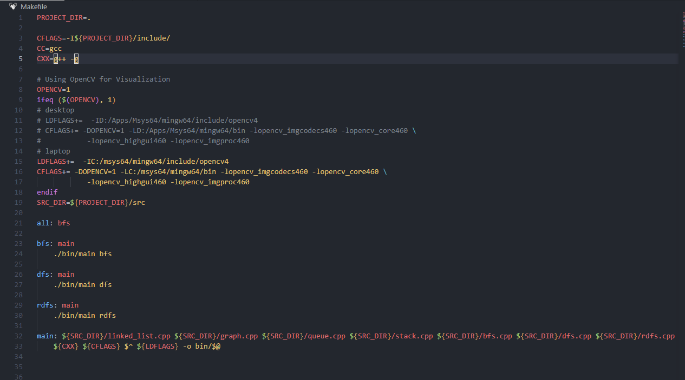
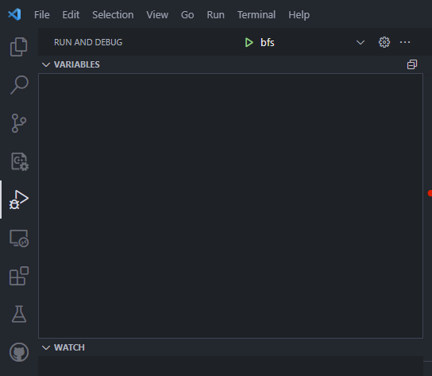

# 1. Download msys2 latest installer

https://github.com/msys2/msys2-installer/releases
<br>after that finishes it should open a terminal window

# 2. Install dependencies

run each of these commands in the msys terminal
pacman -S mingw-w64-x86_64-gcc
pacman -S mingw-w64-x86_64-make
pacman -S mingw-w64-x86_64-gdb
pacman -S mingw-w64-x86_64-opencv
pacman -S mingw-w64-x86_64-qt5-base

Next, go to msys64\mingw64\bin and change `mingw32-make` to just `make`

# 3. Setup vscode

i. extensions
makefile tools (for compiling with the make file)
c/c++ (for intellisense)
makefile tools should have a sidebar icon, if not, make sure vscode has the homework base folder open.

# 4. Makefile changes

change CC and CXX paths:

```CC=C:/MinGW/bin/gcc.exe
CXX=C:/MinGW/bin/g++.exe
to
CC=gcc
CXX=g++ -g
```

msys2 should take care of path variables for you, if this does not work, replace the original path with where you installed msys2 (for example, mine is C:/msys64) screenshot below
the -g flag is so you can debug.
Next, change opencv paths:

````-IC:/OpenCV/include
-LC:/OpenCV/bin
to
-I{your msys64 install location}/mingw64/include/opencv4
-L{your msys64 install location}/mingw64/bin```
Lastly, change every instance of `341` to `460`
your makefile should then look something like the screenshot

````



# 5. Debug setup

For debugging, we're going to use vscode's tasks.json and launch.json to compile the makefile and then run the debugger. If you do not have these create a .vscode folder in your project directory and create the files inside .vscode folder.

## launch.json

This is how my launch.json looks

```
{
    // Use IntelliSense to learn about possible attributes.
    // Hover to view descriptions of existing attributes.
    // For more information, visit: https://go.microsoft.com/fwlink/?linkid=830387
    "version": "0.2.0",
    "configurations": [
        {
            "name": "bfs",
            "type": "cppdbg",
            "request": "launch",
            "program": "${workspaceFolder}/bin/main.exe",
            "args": ["bfs"],
            "stopAtEntry": false,
            "cwd": "${workspaceFolder}",
            "environment": [],
            "externalConsole": false,
            "MIMode": "gdb",
            "miDebuggerPath": "C:/msys64/mingw64/bin/gdb.exe",
            "setupCommands": [
                {
                    "description": "Enable pretty-printing for gdb",
                    "text": "-enable-pretty-printing",
                    "ignoreFailures": true
                }
            ],
            "preLaunchTask": "build"
        }
    ]
}
```

The important pieces to pay attention to are "name", "args", and "preLaunchTask". Name will be what is displayed in the run and debug menu. Name can be set to anything you want, I've set it to be which algorithm i'm testing for assignment 2.
<br>Args is what you're passing into main when launching the exe.
<br>PreLaunchTask is where we will define calling the make file to compile before each debugging session.

## tasks.json

This is my tasks.json file

```
{
"tasks": [
{
    "type": "cppbuild",
    "label": "build",
    "command": "make",
    "args": ["main"],
    "options": {
        "cwd": "${workspaceFolder}"
    },
    "problemMatcher": ["$gcc"],
    "group": {
        "kind": "build",
        "isDefault": true
    },
    "detail": "Task generated by Debugger."
}
],
"version": "2.0.0"
}
```

This will be used to call make and just build the program before each launch. you want to make sure that "label" and "preLaunchTask" (from the launch.json) have the same value. If not, you will get an error.

# 6. Run

Now, you should be able to go to the run and debug tab and press the green arrow(Default shortcut is F5) and then the make file will compile and launch your program in debugging mode.
<br>

